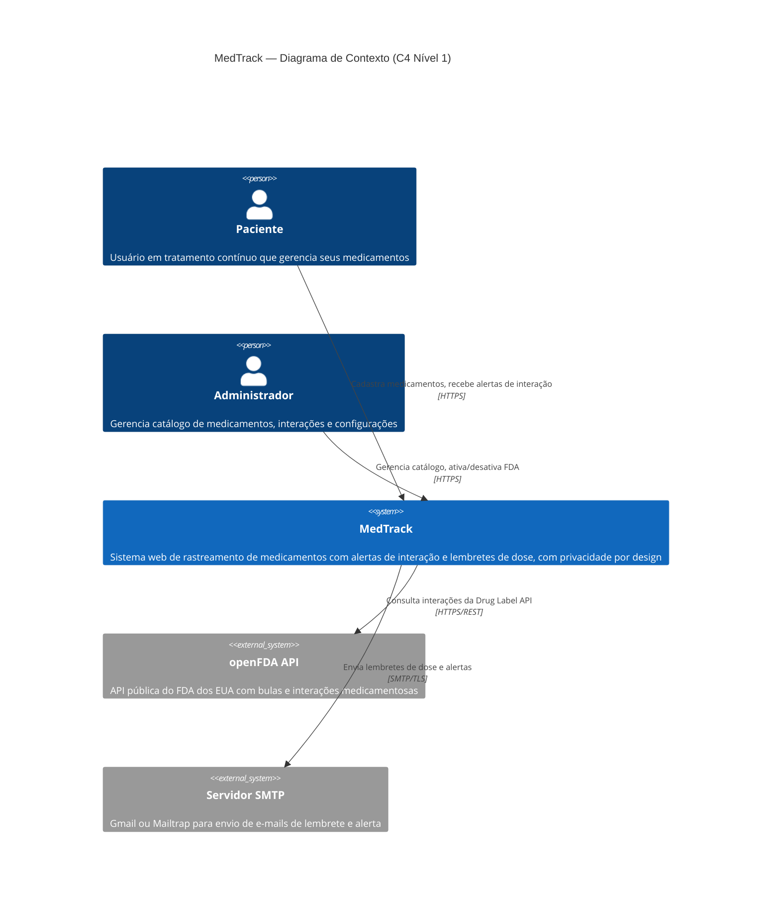
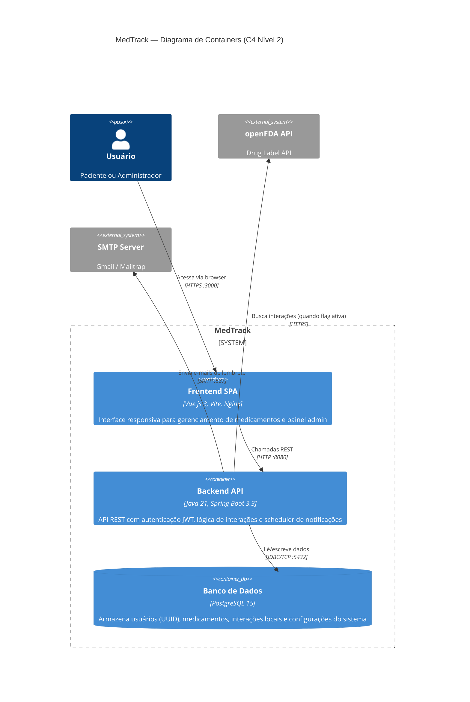

# MedTrack — Diagramas C4 (Mermaid)

## Nível 1: Contexto do Sistema



## Nível 2: Containers



## Nível 3: Componentes (Backend)

```mermaid
C4Component
    title MedTrack Backend — Diagrama de Componentes (C4 Nível 3)

    Container_Boundary(api, "Backend API — Spring Boot 3.3") {

        Component(authCtrl, "AuthController", "Spring MVC", "POST /auth/register, POST /auth/login")
        Component(medCtrl, "MedicationController", "Spring MVC", "GET /medications, GET /medications/{id}")
        Component(umCtrl, "UserMedicationController", "Spring MVC", "CRUD de medicamentos do usuário + verificação de interações")
        Component(adminCtrl, "AdminController", "Spring MVC", "CRUD admin de medicamentos, interações e usuários")
        Component(fdaCtrl, "FdaController", "Spring MVC", "Toggle e status da integração FDA")

        Component(authSvc, "AuthService", "Spring Service", "Registro e login com BCrypt + JWT")
        Component(medSvc, "MedicationService", "Spring Service", "CRUD do catálogo de medicamentos")
        Component(umSvc, "UserMedicationService", "Spring Service", "Adicionar/remover/editar medicamentos do usuário, verificar interações")
        Component(intSvc, "InteractionService", "Spring Service", "Orquestra checkers via Strategy Pattern")
        Component(notifSched, "NotificationScheduler", "Spring @Scheduled", "Verifica lembretes a cada minuto e dispara e-mails")
        Component(notifSvc, "NotificationService", "Spring Service", "Monta e envia e-mails via JavaMailSender")

        Component(localChk, "LocalInteractionChecker", "InteractionChecker", "Busca interações na base PostgreSQL")
        Component(fdaChk, "FdaInteractionChecker", "InteractionChecker", "Busca interações na openFDA (quando flag ativa)")
        Component(fdaClient, "FdaApiClient", "RestClient", "HTTP client para openFDA Drug Label API com timeout 3s")

        Component(jwtFilter, "JwtAuthFilter", "OncePerRequestFilter", "Valida token JWT e popula SecurityContext")
        Component(secConfig, "SecurityConfig", "Spring Security", "Configura rotas públicas, roles e CORS")
        Component(bootstrap, "AdminBootstrap", "CommandLineRunner", "Cria admin inicial no primeiro start")
    }

    ContainerDb(db, "PostgreSQL 15", "")
    System_Ext(fda, "openFDA API", "")
    System_Ext(smtp, "SMTP", "")

    Rel(authCtrl, authSvc, "Usa")
    Rel(medCtrl, medSvc, "Usa")
    Rel(umCtrl, umSvc, "Usa")
    Rel(adminCtrl, medSvc, "Usa")
    Rel(adminCtrl, intSvc, "Usa")
    Rel(fdaCtrl, fdaClient, "Usa")

    Rel(umSvc, intSvc, "Verifica interações ao adicionar")
    Rel(intSvc, localChk, "Consulta base local")
    Rel(intSvc, fdaChk, "Consulta FDA (se ativa)")
    Rel(fdaChk, fdaClient, "Chama API")
    Rel(fdaClient, fda, "GET /drug/label.json", "HTTPS")

    Rel(notifSched, notifSvc, "Dispara envio")
    Rel(notifSvc, smtp, "Envia e-mail", "SMTP")

    Rel(authSvc, db, "Lê/escreve users")
    Rel(medSvc, db, "Lê/escreve medications")
    Rel(umSvc, db, "Lê/escreve user_medications")
    Rel(localChk, db, "Lê interactions")
```



---

## Como visualizar

Estes diagramas usam a sintaxe [Mermaid C4](https://mermaid.js.org/syntax/c4.html). Para renderizar:

- **GitHub**: cole o bloco ```mermaid em qualquer `.md` — o GitHub renderiza nativamente.
- **VS Code**: instale a extensão "Mermaid Preview" ou "Markdown Preview Mermaid Support".
- **Online**: cole em [mermaid.live](https://mermaid.live).
- **Exportar PNG/SVG**: use `mmdc` (Mermaid CLI) ou o botão de export no mermaid.live.
